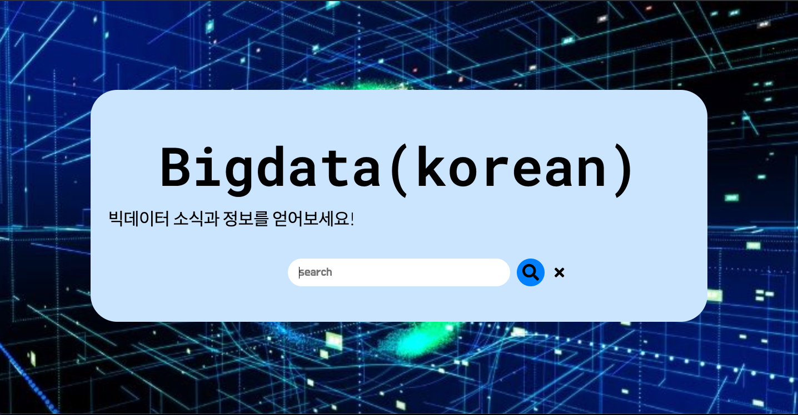

# BigdataSearch


빅데이터란 기존 데이터베이스 관리도구의 능력을 넘어서는 대량의 정형 또는
심지어 데이터베이스 형태가 아닌 비정형의 데이터 집합조차 포함한 데이터로부터 가치를 추출하고 결과를 분석하는 기술입니다.
[위키백과](https://ko.wikipedia.org/wiki/%EB%B9%85_%EB%8D%B0%EC%9D%B4%ED%84%B0)
<br>빅데이터는 현재 많은 관심을 가지고 있는 기술이기 때문에 관련 기술들과 소식들이 많습니다.
<br>손쉽게 검색으로 관련 뉴스들을 찾아보도록 도와주려고 합니다.
<br>아래 검색창에 관련 정보를 입력하시면 내용이 출력됩니다.
<br>

## How to Make
1. 기존의 [horror_generater](https://github.com/audrb96/horror_generater) 는 이미 fine-tuning 된 gpt2모델을 [huggingface](https://huggingface.co/) 를 통해 가져와서 해당 모델을 다른 분들의 <br>
   [Ainize](https://ainize.ai/dashboard) 를 참고하여 만들었습니다. <br>
   이번에는 [Teachable NLP](https://ainize.ai/teachable-nlp) 를 통해 직접 bigdata관련 뉴스 dataset을 Kogpt2에 fine-tuning 하여 만들었습니다.
   

   ```python

   context = request.form['context']
    headers = {'Content-Type': 'application/json; charset=\'utf-8\''}
    num_samples = 1
    length = 300

    data = {
        "text": context,
        "num_samples": num_samples,
        "length": length
    }
    response = requests.post('https://train-kovgd07j8yvco5i03qo3-gpt2-train-teachable-ainize.endpoint.ainize.ai/predictions/gpt-2-ko-small-finetune',headers=headers,json=data)
 ```
## ainize With CLI
curl --request POST 'https://train-kovgd07j8yvco5i03qo3-gpt2-train-teachable-ainize.endpoint.ainize.ai/predictions/gpt-2-ko-small-finetune' \
  --header 'Content-Type: application/json' \
  --data-raw '{
    "text": "근육이 커지기 위해서는",
    "num_samples": 5,
    "length": 8
  }'

## Considerations
중간중간 이미지파일 없이 이미지설명이 들어간 부분이 있습니다.
Finetuned Model을 사용하기 때문에 로딩 시간이 소요됩니다. 조금만 기다려주세요
chrome사용을 권장합니다.

## Acknowledgments
* 대부분의 시간을 dataset을 찾는데 사용한 것 같습니다. 웹사이트에서 데이터를 가져오기 위해 크롤링을 공부해야 겠다는 필요성을 느꼈습니다.
* 처음에 teachable NLP를 사용하는데 기존의 teachable NLP를 사용한 gpt2모델과 kogpt2모델의 사용법이 달라 헤맸습니다..
* css의 숙련도가 떨어져 버튼의 위치를 조정하는데 헤맸습니다.. css 공부도 해야겠다는 생각을 했습니다.
* 기존에는 GKE로 배포했는데 ainize로 처음 배포해보았습니다.

