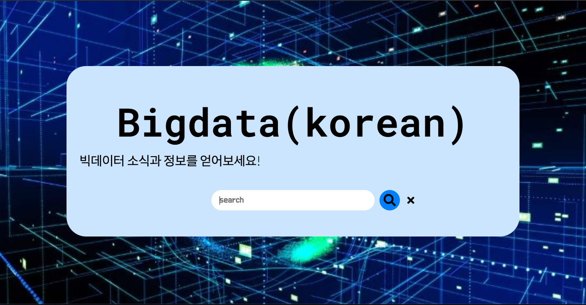
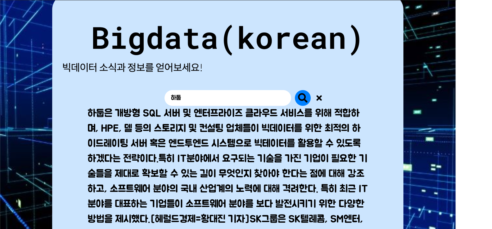

# BigdataSearch


Big data is a large number of structured or structured beyond the capabilities of traditional database management tools.
It's a technology that extracts value from data and analyzes results from data that includes unstructured datasets, not even in the form of databases.
[Wiki Encyclopedia] (https://ko.wikipedia.org/wiki/%EB%B9%85_%EB%8D%B0%EC%9D%B4%ED%84%B0)
<br>Big Data is a technology of great interest today, so there's a lot of related technology and news.
<br>I'd like to help you search easily for related news.
Enter the relevant information in the search box below and the contents will be printed out.
<br>

## How to Make
1. The existing [horror_generator] (https://github.com/audrb96/horror_generater)) has imported a gpt2 model that has already been fine-tuned through [huggingface] (https://huggingface.co/)) and imported that model from other people's <br>.
[Ainize] (created by referring to https://ainize.ai/dashboard)). <br>
This time, [Teachable NLP] (https://ainize.ai/teachable-nlp)) directly fine-tuned bigdata news dataset to Kogpt2.


```python

context = request.form['context']
headers = {'Content-Type': 'application/json; charset=\'utf-8\''}
num_samples = 1
length = 300

data = {
"text": context,
"num_samples": num_samples,
"length": length
}
response = requests.post('https://train-kovgd07j8yvco5i03qo3-gpt2-train-teachable-ainize.endpoint.ainize.ai/predictions/gpt-2-ko-small-finetune',headers=headers,json=data)
```
## ainize With CLI
curl --request POST 'https://train-kovgd07j8yvco5i03qo3-gpt2-train-teachable-ainize.endpoint.ainize.ai/predictions/gpt-2-ko-small-finetune' \
--header 'Content-Type: application/json' \
--data-raw '{
"text": "For muscles to grow,"
"num_samples": 5,
"length": 8
}'

## Considerations
There are parts with image description without image file.
Loading time is required because the Finetuned Model is used. Hold on a minute, please.
We recommend using chrome.

## Acknowledgments
* Most of the time seems to have been spent looking for dataset. I felt the need to study crawl to get data from the website.
* Initially, we used teachable NLP, but we found that gpt2 and kogpt2 models used teachable NLP were different.
* Css was not skilled enough to adjust the position of the button. I thought I should study css.
* Previously, it was distributed as GKE, but it was first distributed as Ainize.
